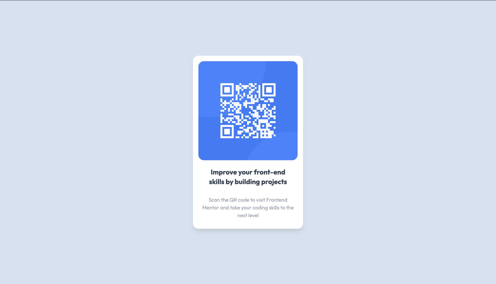

# Frontend Mentor - QR code component solution

This is a solution to the [QR code component challenge on Frontend Mentor](https://www.frontendmentor.io/challenges/qr-code-component-iux_sIO_H). Frontend Mentor challenges help you improve your coding skills by building realistic projects.

## Table of contents

- [Overview](#overview)
    - [Screenshot](#screenshot)
    - [Links](#links)
- [My process](#my-process)
    - [Built with](#built-with)
    - [What I learned](#what-i-learned)
- [Author](#author)

**Note: Delete this note and update the table of contents based on what sections you keep.**

## Overview

### Screenshot



### Links

- Solution URL: [Add solution URL here](https://your-solution-url.com)
- Live Site URL: [Add live site URL here](https://your-live-site-url.com)

## My process

### Built with

- Semantic HTML5 markup
- CSS custom properties
- Mobile-first workflow
- [React](https://reactjs.org/) - JS library
- [Gatsby.js](https://www.gatsbyjs.com/) - React framework
- [Tailwind](https://tailwindcss.com/) - For styles

### What I Learned
- Using Web Fonts in Gatsby - [Learn More](https://www.gatsbyjs.com/docs/how-to/styling/using-web-fonts/)
- How to change favicon in Gatsby -[When Shit Breaks](https://whenshitbreaks.com/blog/how-to-change-the-favicon-in-gatsby/)
### Awesome sections

Here are some snippets of the code that I think are awwwwesome:

```html
 <div className={"qr-image"} style={{backgroundImage:`url(${qr})`}}></div>
```
```css
.card{
  @apply bg-white rounded-2xl p-4 w-[90vw] md:w-80 flex flex-col items-center space-y-5 pb-5 text-center shadow-lg hover:bg-gray-50 transition-all ease-in-out hover:scale-105;
}
```

## Author

- Website - [Issah Muniru](https://www.your-site.com)
- Frontend Mentor - [@MuniruIssah](https://www.frontendmentor.io/profile/MuniruIssah)
- Twitter - [@ningen_dewa_nai](https://www.twitter.com/ningen_dewa_nai)
